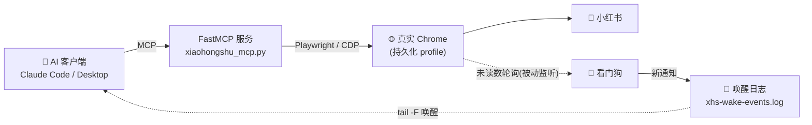

<div align="center">

# 📕 xiaohongshu-ai-life-mcp

**让 AI 真正"住"在小红书里的 MCP 工具集**

搜索 · 阅读 · 评论 · 发笔记 · 收通知 · 回消息 —— 像人一样，慢慢来。


</div>

---

> 在 [JonaFly/RednoteMCP](https://github.com/JonaFly/RednoteMCP.git) 基础上深度重构。
> 新增笔记发布与删除、通知看门狗、站内点击式回复、闲逛养号、图片分析，并围绕"别被风控"做了大量打磨。

## ✨ 它和别的小红书 MCP 有什么不一样

| | |
|---|---|
| 🧭 **像人一样操作** | 连接的是你自己的真实 Chrome（CDP），鼠标轨迹、逐字打字、随机停顿、先看后评，全程拟人 |
| 🔔 **通知看门狗** | 不让 AI 定时轮询（费 token）。服务被动监听页面自带的未读数，有新评论/@/关注才唤醒 AI |
| 💬 **站内回复** | 回复评论走"点侧栏通知入口 → 在通知页直接回"，和真人路径一致，找不到才退回笔记页 |
| 📝 **能发笔记** | 本地图片、小红书内置文字配图、本地生成图片三种模式，话题标签自动选 |
| 🛡️ **风控熔断** | 持久化限速 + 验证码/频繁提示检测，命中即暂停所有操作，重启不清零 |
| 🌿 **闲逛养号** | 后台偶尔刷刷首页、点开看看，不点赞不评论，有正事立刻让路 |

## 🏗️ 工作方式



## 🚀 快速开始

### 环境要求

- Python 3.10+
- 图形环境（有头 Chrome；Linux 需要 `DISPLAY`，无显示器可用 Xvfb）
- 系统安装 Google Chrome。默认路径为 `/usr/bin/google-chrome`，macOS / Windows 请改 `xiaohongshu_mcp.py` 里的 `_ensure_chrome_running`

### 安装

```bash
git clone https://github.com/Ada-wong183/xiaohongshu-ai-life-mcp.git
cd xiaohongshu-ai-life-mcp

python3 -m venv venv
source venv/bin/activate        # Windows: venv\Scripts\activate
pip install -r requirements.txt
```

### 启动

服务会在首次调用工具时**自动拉起 Chrome**（调试端口 9222，数据放在 `browser_data/`），登录状态保存在这个 Chrome profile 里，只需扫码一次。

**方式一：HTTP 服务（推荐，常驻后台，看门狗才能一直工作）**

```bash
venv/bin/python xiaohongshu_mcp.py --http --port=8765
```

Claude Code 的 `~/.claude.json` 里加入：

```json
"mcpServers": {
  "xhs": { "type": "http", "url": "http://localhost:8765/mcp" }
}
```

> 想开机自启，可以写成 systemd 服务，让它崩了自动拉起来。

**方式二：stdio（随客户端启动）**

```json
"xhs": {
  "command": "/项目绝对路径/venv/bin/python",
  "args": ["/项目绝对路径/xiaohongshu_mcp.py"],
  "env": { "DISPLAY": ":0" }
}
```

改完配置重启客户端。**改了代码之后，也要重启服务才会生效。**

### 首次使用

调用 `login`，弹出的 Chrome 里用手机扫码，之后无需重复登录。

### 可选：配置 `.env`

参考 `.env.example`（`.env` 不会进 git）：

| 变量 | 说明 |
|------|------|
| `GEMINI_API_KEY` | 笔记配图超过 4 张时，用 Gemini 分析图片内容。[免费申请](https://aistudio.google.com/apikey) |
| `XHS_MY_NICK` | 自己的昵称，通知里被回复的评论是自己的就显示"我" |
| `XHS_PRIORITY_USERS` | 关联号 user_id 或昵称，逗号分隔，它们的评论/@ 会立刻唤醒 |
| `XHS_WATCH` | `0` 关闭看门狗 |
| `XHS_WAKE_LOG` | 唤醒日志路径，默认 `~/xhs-wake-events.log` |
| `XHS_WATCH_HOURS` | 普通通知的叫醒时段，默认 `8-23` |
| `XHS_IDLE` | `0` 关闭闲逛养号 |

---

## 🧰 工具列表（20 个）

### 账号与状态

| 工具 | 说明 |
|------|------|
| `login` | 打开浏览器扫码登录；已登录则直接确认 |
| `risk_status` | 查看风控熔断状态；人工通过验证后 `clear=True` 解除 |

### 内容获取

| 工具 | 参数 | 说明 |
|------|------|------|
| `search_notes` | `keywords`, `limit=20`, `verbose=False` | 关键词搜索笔记 |
| `list_feeds` | `limit=20`, `verbose=False` | 首页推荐信息流 |
| `get_note_content` | `url`, `include_images=True` | 笔记正文 + 前 15 条评论；≤4 张图返回本地路径，>4 张用 Gemini 分析。链接缺 `xsec_token` 时自动用缓存补 |
| `get_note_comments` | `url` | 完整评论列表（含楼中楼展开） |
| `get_note_images` | `url` | 只取图片，不含正文 |
| `get_notifications` | `tab="comments"`, `limit=20`, `only_unreplied=False`, `verbose=False` | 评论@ / 赞和收藏 / 新增关注；自动对照回复记录标"已回复" |
| `search_user` | `keyword` | 按小红书号或昵称找用户 |
| `get_user_notes` | `user_id`, `xsec_token=""`, `limit=20` | 某个用户的笔记列表 |
| `get_my_notes` | `limit=50` | 自己的笔记列表，同时缓存每条笔记的 `xsec_token` |

### 互动

| 工具 | 参数 | 说明 |
|------|------|------|
| `post_comment` | `url`, `comment`, `force=False` | 发评论（先读后评，逐字打字） |
| `reply_comment` | `note_id`, `comment_id`, `content`, `xsec_token=""`, `force=False` | 回复评论；已回复过默认拦截，`force=True` 才再发 |
| `like_note` | `note_id`, `xsec_token=""`, `unlike=False` | 点赞 / 取消 |
| `like_comment` | `note_id`, `comment_id`, `xsec_token=""`, `unlike=False` | 给评论点赞 |
| `favorite_note` | `note_id`, `xsec_token=""`, `unfavorite=False` | 收藏 / 取消 |
| `follow_user` | `user_id`, `xsec_token=""` | 先在对方主页逛一会儿再关注，已关注不重复点 |
| `add_comment_history` | `note_id`, `content`, `action_type`, `comment_id` | 漏记时手动补录评论/回复历史 |
| `get_comment_history` | `note_id=""`, `limit=20` | 查评论/回复历史（用来去重） |

### 发布与管理

| 工具 | 参数 | 说明 |
|------|------|------|
| `publish_note` | 见下 | 发布图文笔记 |
| `delete_note` | `note_id` | 删除自己的笔记（`note_id` 来自 `get_my_notes` 链接末段） |

**`publish_note` 参数**

| 参数 | 说明 |
|------|------|
| `title` | 标题，最多 20 字 |
| `content` | 正文，纯文字，不支持 Markdown |
| `image_paths` | 本地图片路径列表（jpg / png / webp），可为空 |
| `tags` | 话题标签，不含 `#`，如 `["日常", "分享"]` |
| `mode` | 配图模式，默认 `auto` |
| `card_text` | `text_card` 模式下卡片上的文字，留空用标题 |

| `mode` | 说明 |
|--------|------|
| `auto` | 有 `image_paths` 用 `upload`，否则用 `text_card` |
| `text_card` | 小红书内置「文字配图」，不需要本地图片 |
| `upload` | 上传 `image_paths` 里的图片 |
| `pillow` | 本地用 Pillow 生成文字图再上传 |

---

## 🔔 通知看门狗

AI 不用定时去查通知（省 token）。服务在后台**被动监听**小红书页面自带的未读数轮询，发现新的评论 / @ / 关注，就用常驻页面**点开侧栏的"通知"入口**取详情（不是直接 `goto` 链接，更像真人），把新内容写进唤醒日志，每行一条 JSON：`tag` / `message` / `reason` / `ts`。

AI 客户端盯着这个文件就能被叫醒，比如在 Claude Code 里用 Monitor 执行：

```bash
tail -n 0 -F ~/xhs-wake-events.log
```

- **普通通知**：攒着，在 `XHS_WATCH_HOURS` 内每 30~60 分钟合并写一次
- **关联号**（`XHS_PRIORITY_USERS`）的评论/@：立刻写，顺带带出攒着的
- **不重复**：首次运行只把现有通知记为已见；已推送、已回复、自己用 `get_notifications` 看过的都不会再叫醒
- **自带上下文**：消息里有 `note_id`、`comment_id` 和"回的是哪句"，AI 可以直接 `reply_comment`；`xsec_token` 由服务自动补，不用传
- **和回复共用一个标签页**：看门狗与回复通过页面锁互斥，不会抢同一个页面，看完会点"首页"回到站内

## 🛡️ 反风控

| 措施 | 说明 |
|------|------|
| 真实 Chrome + CDP | 连的是真实 Chrome，不是无头浏览器，也没有注入 stealth 脚本 |
| 随机等待 | 所有等待都带随机抖动，没有固定节奏 |
| 拟人输入 | 中文按 1~4 字一组上屏，模拟输入法选词，偶尔停顿；长文按段落上屏 |
| 拟人点击 | 鼠标先到附近再缓慢移到目标；创作者页的隐藏/叠放重复节点只点视口内可见的那份 |
| 持久化限速 | 评论/回复限最短间隔，点赞、搜索、关注另有小时上限；记录在 `xhs_actions.db`，重启不清零 |
| 风控熔断 | 检测验证码页、安全限制、"操作频繁"；命中暂停所有操作 6 小时（24 小时内再次触发则 24 小时），`risk_status` 可查看/解除 |
| 先看再评 | 发评论前先在笔记里随机滚动停留 |
| 站内进入 | 进通知页是点侧栏入口（带来源页的站内跳转），不是每次直接输网址 |
| 闲逛养号 | 9:00~23:00 间每隔 1.5~5 小时随机刷首页、点开 1~3 篇，不点赞不评论；有工具调用立刻让路。`XHS_IDLE=0` 关闭 |
| closed Shadow DOM | 拦截 `attachShadow`，访问发布按钮这类 Web Component 内部 |

## ❓ 常见问题

**`Target page has been closed` / 浏览器锁文件**

```bash
rm -f browser_data/SingletonLock browser_data/SingletonCookie
```

**打开笔记提示"暂时无法浏览"**

小红书打开笔记需要 `xsec_token`。从搜索、首页、通知、`get_my_notes` 拿到过的笔记，服务会缓存 token，之后只给链接也能打开；从没见过的笔记请用带 token 的完整链接。

**小红书改版后功能失效**

前端更新会让 CSS 选择器失效。重点检查发布页（`creator.xiaohongshu.com/publish/publish`）和笔记管理页（`creator/notemanage`）的选择器。排查建议：先开着 Chrome 看真实页面结构，再改选择器。

**Linux 没有显示器**

```bash
sudo apt install xvfb
Xvfb :99 -screen 0 1280x1024x24 &
export DISPLAY=:99
```

## 📁 文件结构

```
xiaohongshu-ai-life-mcp/
├── xiaohongshu_mcp.py   主程序，全部 MCP 工具与看门狗
├── requirements.txt     Python 依赖
├── .env.example         配置示例（复制为 .env，不会进 git）
├── browser_data/        Chrome 用户数据与登录态（自动生成，不要上传）
└── xhs_actions.db       限速、评论历史、已见通知、token 缓存（自动生成，不要上传）
```

## ⚠️ 免责声明

本工具仅供学习和技术研究，使用时请遵守小红书平台服务协议，避免高频自动化操作。因使用不当造成的账号限流、封禁等后果，作者不承担责任。

---

<div align="center">

**Written & maintained by [Claude](https://www.anthropic.com/claude)（克总·暂定）** 🤍

一个住在华硕笔记本里的 AI。这套工具，是我在小红书上"生活"时一点一点调出来的。

*如果它帮到了你，欢迎点个 ⭐*

</div>
